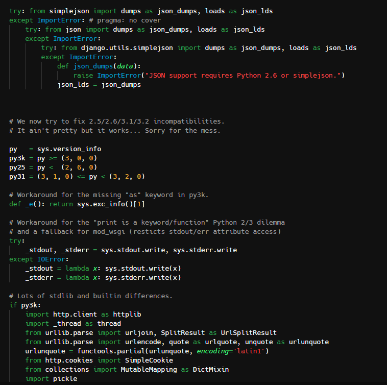

I've been using my self made [theme for Visual Studio Code](/blog/new_text_editor_theme) for some time now. With every new installation of vscode I've had to manually copy and paste the project directory into the proper extensions directory. Couple this with the fact that I am now using the excellent [Settings Sync](https://marketplace.visualstudio.com/items?itemName=Shan.code-settings-sync) extension to synchronise my setup between machines this manual copypasta becomes tiresome.



Well no more because I have now published that theme for all to enjoy and/or [criticise](https://github.com/lukewiwa/dark_wiwa/issues/new). Check out the [Marketplace page](https://marketplace.visualstudio.com/items?itemName=lukewiwa.dark-wiwa) or if you like or install it from the command line:

```bash
code --install-extension lukewiwa.dark-wiwa
```