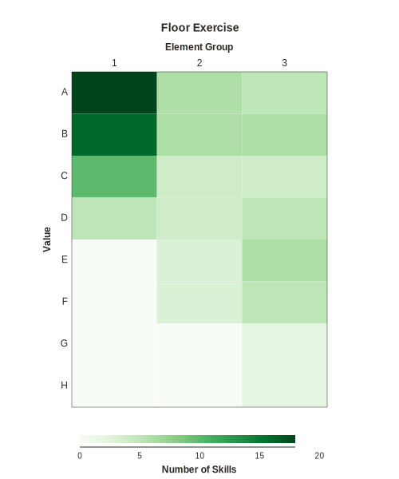
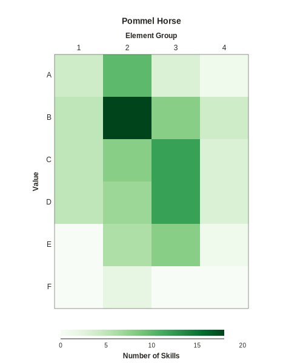
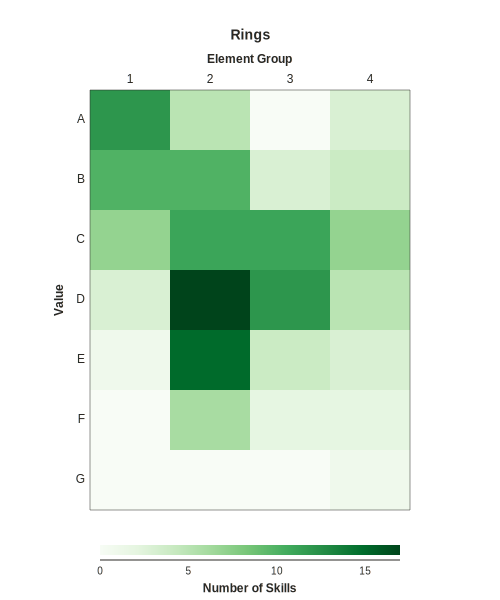
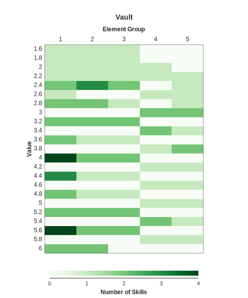
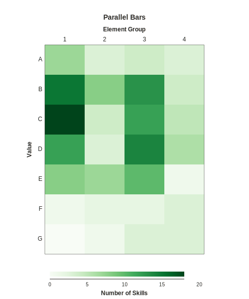
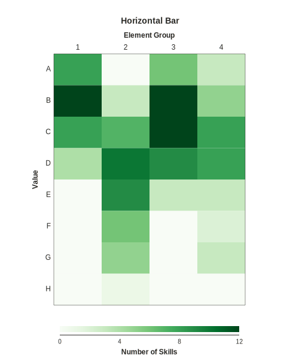

The Code of Points for the 2020 Olympic cycle is official. The time has come to make some wild speculations about the consequences of these code changes.

I decided to map the distribution of skills across value and element groups using a heatmap type graph. Not extremely complex but enough to get an idea of where skills are concentrated in certain values and element groups. The darker the colour, the more occurrences of that skill. To see more varied and, in my opinion, interesting routines I’m willing to speculate we need two things from these graphs:

1. A concentrated distribution at and above values of C, since most routines will be made up by these skills.
2. A more uniform distribution across element groups, since this will encourage variety with lots of skills to choose from.

My predictions looking at these charts are:

- Floor will be tend towards similarity as there are few skills to choose. Routines will trend towards the same skills and combinations in slightly varying order.
- Pommel and Rings routines may have some difference and flair with a good number of skills available to construct differing combinations. Although in saying that there will be a core set of skills which almost all routines will contain.
- Parallel Bars and Horizontal Bar will be where we see the most variety in routine construction with a large range of skills on offer over different element groups. Gymnasts will be able to play to their strengths more and routines will be more unique.
